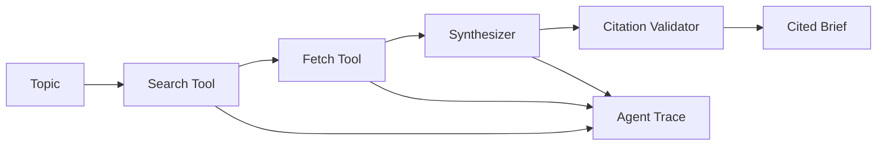

# Research Brief

**Multi-step research agent that produces cited briefs — with tool traces, not vibes.**

Portfolio project #2: an end-to-end GenAI application with orchestration, grounding checks, API, and eval harness.

## What it does

Given a topic, the agent:

1. **Search** — finds candidate sources
2. **Fetch** — extracts relevant excerpts
3. **Synthesize** — writes a structured brief with citations
4. **Validate** — checks that citations map to real sources

Every step is recorded in a **trace** for debugging and MLOps evals.

## Quick start

```bash
git clone https://github.com/vaas77/research-brief.git
cd research-brief
python -m venv .venv
.venv\Scripts\activate
pip install -e ".[dev,llm]"

# Demo with bundled mock sources (no API keys)
research-brief demo

# Custom topic
research-brief run "What are the tradeoffs of RAG vs fine-tuning?"

# API server
research-brief serve
```

## Architecture



**Design principle:** Retrieval and extraction run before synthesis. The LLM (when enabled) only writes from fetched excerpts.

## Project structure

```
project2/
├── src/research_brief/
│   ├── agent/          # Pipeline orchestration
│   ├── search/         # Search + fetch providers
│   ├── synthesis/      # Template + optional OpenAI
│   ├── validation/     # Citation grounding checks
│   └── api/            # FastAPI
├── eval/               # Golden test cases
├── tests/
└── web/                # Streamlit UI (coming soon)
```

## Development

```bash
pip install -e ".[dev,llm]"
pytest -q
```

## Publish to GitHub

```bash
git init
git add .
git commit -m "Initial commit: Research Brief agent"
git branch -M main
git remote add origin https://github.com/vaas77/research-brief.git
git push -u origin main
```

Create the empty repo on GitHub first (**New repository** → name: `research-brief` → Public → do not add README).

## Roadmap

- [x] Agent pipeline with mock search + template synthesis
- [x] Agent trace + citation validation
- [x] CLI + FastAPI
- [ ] Tavily / live web search
- [ ] OpenAI synthesis with grounding gate
- [ ] Streamlit UI
- [ ] GitHub Actions CI + deploy
