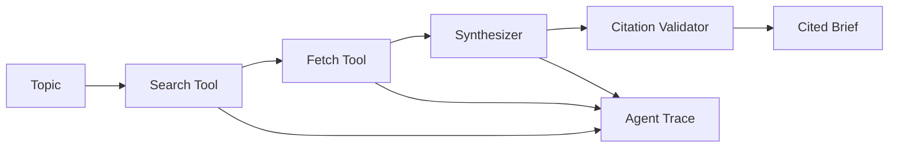

# Research Brief

**Multi-step research agent that produces cited briefs — with tool traces, not vibes.**

[](https://www.python.org/downloads/)
[](https://research-brief-aqpfqsjyvybcrv594j4kk5.streamlit.app/)
[](#development)

Portfolio GenAI/MLOps project: search → fetch → synthesize → validate, with optional Tavily web search and OpenAI synthesis gated by citation grounding checks.

## What it does

Given a topic, the agent:

1. **Search** — Tavily web search (or mock corpus for offline demo)
2. **Fetch** — pulls page excerpts from source URLs
3. **Synthesize** — template brief or OpenAI polish
4. **Validate** — citation coverage + grounding checks

Every step is recorded in an **agent trace** for debugging and evals.

**Live demo:** https://research-brief-aqpfqsjyvybcrv594j4kk5.streamlit.app/

Try **Generate brief** with mock search (no keys) or Tavily for live web research.

## Quick start

```bash
git clone https://github.com/vaas77/research-brief.git
cd research-brief
python -m venv .venv
.venv\Scripts\activate
pip install -e ".[dev,web,llm]"
cp .env.example .env
```

### Offline demo (no API keys)

```bash
research-brief demo
research-brief web
```

### Live research (Tavily + optional OpenAI)

```env
TAVILY_API_KEY=tvly-...
OPENAI_API_KEY=sk-...
SEARCH_PROVIDER=auto
SYNTHESIS_MODE=openai
FETCH_MODE=live
```

```bash
research-brief run "Latest developments in AI agents" --search-provider tavily --synthesis-mode openai
research-brief serve
```

## Architecture



**Design principle:** Retrieval and extraction run before synthesis. The LLM only rephrases verified excerpts and must preserve source IDs.

## Project structure

```
research-brief/
├── src/research_brief/
│   ├── agent/          # Pipeline orchestration
│   ├── search/         # Tavily + mock + fetch
│   ├── synthesis/      # Template + OpenAI
│   ├── validation/     # Citations + grounding
│   ├── jobs/           # Async job queue (SQLite + thread pool)
│   ├── tracing/        # OpenTelemetry + LangSmith spans
│   └── api/            # FastAPI
├── web/app.py          # Streamlit UI
├── eval/               # Golden test cases
└── tests/
```

## API

```bash
research-brief serve
```

- `GET /health`
- `POST /research` — synchronous run
- `POST /research/jobs` — enqueue background job
- `GET /research/jobs/{job_id}` — poll job status/result

Example body for `POST /research`:

```json
{
  "topic": "What are the tradeoffs of RAG vs fine-tuning?",
  "max_sources": 3,
  "search_provider": "mock",
  "fetch_mode": "snippet",
  "synthesis_mode": "template"
}
```

### Observability (optional)

```bash
pip install -e ".[observability,langsmith]"
```

```env
OTEL_ENABLED=true
OTEL_SERVICE_NAME=research-brief
LANGSMITH_API_KEY=lsv2-...
LANGSMITH_PROJECT=research-brief
LANGCHAIN_TRACING_V2=true
```

Pipeline steps emit OpenTelemetry spans (console exporter) and LangSmith runs when keys are set. Completed briefs may include a `trace_id` field.

## Deploy to Streamlit Cloud

1. Push repo to GitHub
2. [share.streamlit.io](https://share.streamlit.io) → **New app**
3. Main file: `web/app.py`
4. Optional secrets: `TAVILY_API_KEY`, `OPENAI_API_KEY`

## Development

```bash
pip install -e ".[dev,web,llm]"
pytest -q
research-brief config
```

## Roadmap

- [x] Agent pipeline with trace
- [x] Mock search corpus + Tavily integration
- [x] Live URL fetch
- [x] OpenAI synthesis with grounding validation
- [x] CLI + FastAPI + Streamlit UI
- [x] Eval harness (10+ golden cases)
- [x] GitHub Actions CI
- [x] Live Streamlit Cloud deploy
- [x] Async job queue for long research runs
- [x] OpenTelemetry + LangSmith tracing hooks

## License

MIT
